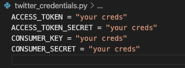

# Self Training AI Twitter Bot

### summary:

A twitter bot that trains itself on trending topics, and tweets automatically

### requirements:

In order to run you must have installed the following packages

`pip3 install tweepy`

`pip3 install gpt-2-simple`

You will also need to ensure that you have tensorflow 1.13.1 installed with the following command:

`pip3 install tensorflow==1.13.1`

### Credentials:

You will need to sign up for a twitter developer account and create your own twitter application in order to be able to use the tweepy api. Once you've done this you'll need to input your credentials into the twitter_credentials.py file.

### Warnings:

This is a disk space and CPU hog! GPT2 will create approximately 1GB file for every trending topic that it trains on, and the more it trains on that model the larger that file will grow. I reccomend running it on a cloud instance with a large storage capacity, or possibly adding some code to remove the model checkpoints after training is complete to avoid filling your disk.

### Tutorial

YouTube tutorial is available [here](https://youtu.be/tSaVryuzFTM)
